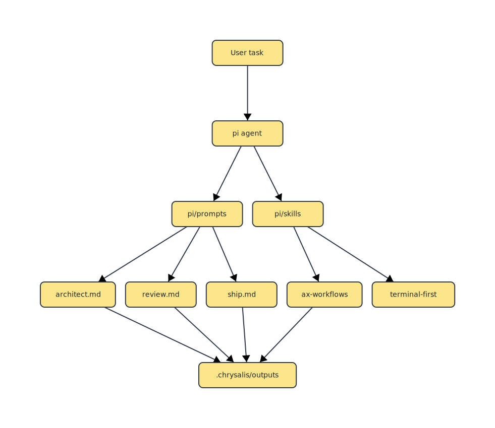

# Chrysalis Forge

An evolvable, safety-gated agent framework with DSPy-style optimization and self-improving capabilities.

## Overview

Chrysalis Forge is a TypeScript-based environment for building and optimizing autonomous agents. It combines modern LLM integration with the Pi agent framework and a powerful evolution engine.


### Key Features

- **Archival Evolution**: HyperAgents-style evolutionary search over agent prompts and workflows with full lineage tracking.
- **Evolvable Context**: Self-optimizing system prompts via GEPA (General Evolvable Prompting Architecture).
- **DSPy-style DSL**: Signatures, Modules (Predict, ChainOfThought), and Optimizers.
- **Context-Tiered Pricing**: Accurate cost tracking with rates that scale based on context length (e.g. Gemini 3.1 Pro tiered rates).
- **MAP-Elites Optimization**: Evolutionary optimization targeting cost, latency, and token efficiency.
- **Grounded Scoring**: Automated grading based on precision, speed ($/ms), and resource consumption.
- **Tiered Sandboxing**: Four levels of security isolation for code execution.
- **66+ Built-in Tools**: File operations, code search, git, jj (Jujutsu), web search, test generation, LLM-as-judge evaluation, and self-evolution.
- **Evolvable Tool System**: Tools themselves can be evolved at runtime via feedback-driven mutation with novelty gating and variant archiving.
- **Parallel Sub-Agents**: Spawn concurrent tasks with specialized tool profiles.
- **Auto-Correction Loop**: Retry failed code execution with automatic fixes.
- **Vector Memory & RDF**: Semantic search and knowledge graph integration.
- **Dynamic Stores**: Key-value, log, set, and counter stores for persistent agent state.
- **File Rollback**: Automatic file versioning with instant undo.

## Tool Categories

The LLM agent can directly call these tools. Each tool is registered with the Pi runtime and available in every session.

### File & Code Tools (Pi built-in)
| Tool | Description |
|------|-------------|
| `read` | Read file contents |
| `write` | Create/overwrite files |
| `edit` | Surgical text replacement in files |
| `bash` | Execute shell commands |
| `grep` | Regex search across files |
| `find` | Find files by name/pattern |
| `ls` | Directory listing |

### Git Tools
| Tool | Description |
|------|-------------|
| `git_status` | Repository status |
| `git_diff` | Show staged/unstaged changes |
| `git_log` | Commit history |
| `git_commit` | Stage and commit |
| `git_checkout` | Branch operations |
| `git_add` | Stage files |
| `git_branch` | List/create/delete branches |

### Jujutsu (jj) Tools
| Tool | Description |
|------|-------------|
| `jj_status` | Current state |
| `jj_log` | Commit graph |
| `jj_diff` | Show changes |
| `jj_undo` | Undo last operation |
| `jj_op_log` | Operation history |
| `jj_op_restore` | Restore to any past state |
| `jj_workspace_add` | Create parallel worktree |
| `jj_workspace_list` | List workspaces |
| `jj_describe` | Set commit message |
| `jj_new` | Create new change |

### Sub-Agent Tools
| Tool | Description |
|------|-------------|
| `spawn_task` | Spawn parallel sub-agent with profile |
| `await_task` | Wait for sub-agent completion |
| `task_status` | Check sub-agent status |

**Profiles**: `editor`, `researcher`, `vcs`, `all`

### Self-Evolution Tools
| Tool | Description |
|------|-------------|
| `evolve_system` | Evolve system prompt via GEPA mutation |
| `evolve_meta` | Evolve the meta/optimizer prompt |
| `evolve_harness` | Mutate harness strategy (12 evolvable fields) |
| `log_feedback` | Log task results for profile learning |
| `suggest_profile` | Get optimal profile for task type |
| `profile_stats` | View profile performance data |
| `archive_list` | List MAP-Elites archived variants |
| `evolution_stats` | Current evolution state summary |

### Decomposition Tools
| Tool | Description |
|------|-------------|
| `decompose_task` | Break task into subtasks with dependencies |
| `classify_task` | Classify task type (refactor/debug/implement/etc.) |
| `decomp_vote` | First-to-K voting on decomposition alternatives |

### Judge & Evaluation Tools
| Tool | Description |
|------|-------------|
| `use_llm_judge` | Evaluate code/text using LLM-as-judge with configurable criteria and pass/fail threshold |
| `judge_quality` | Judge code quality across correctness, maintainability, and best practices |

### Test Generation Tools
| Tool | Description |
|------|-------------|
| `generate_tests` | Generate unit tests from source files using LLM with framework auto-detection |
| `generate_test_cases` | Generate specific test cases for a function with concrete inputs/outputs |

### Priority & Profile Tools
| Tool | Description |
|------|-------------|
| `set_priority` | Set execution profile (fast/cheap/best/verbose) with reason tracking |
| `get_priority` | Get current active execution profile |
| `suggest_priority` | Suggest optimal profile based on task description or type |

### Tool Evolution Tools
| Tool | Description |
|------|-------------|
| `evolve_tool` | Evolve a tool's description/parameters via feedback-driven mutation |
| `list_tools` | List all registered tools with enabled/disabled status |
| `tool_variants` | List evolution variants for tools |
| `select_tool_variant` | Select a specific variant as active |
| `enable_tool` | Enable a disabled tool |
| `disable_tool` | Disable a tool |
| `tool_stats` | Get tool registry statistics |
| `tool_evolution_stats` | Get tool evolution state and variant counts |

### RDF & Memory Tools
| Tool | Description |
|------|-------------|
| `rdf_load` | Load triples file into a named graph |
| `rdf_query` | Query knowledge graph with pattern matching |
| `rdf_insert` | Insert a triple into the store |

### Web Tools
| Tool | Description |
|------|-------------|
| `web_fetch` | Fetch URL content (cached) |
| `web_search` | Exa AI semantic search |

**Requires**: `EXA_API_KEY` env var for Exa web search.

### Store Tools
| Tool | Description |
|------|-------------|
| `store_create` | Create kv/log/set/counter store |
| `store_list` | List dynamic stores |
| `store_get` | Read from a store |
| `store_set` | Write to a store |
| `store_rm` | Remove a key from a store |
| `store_dump` | Dump entire store contents |
| `store_delete` | Delete a store |

### Rollback & Cache Tools
| Tool | Description |
|------|-------------|
| `file_rollback` | Restore file to previous version |
| `file_rollback_list` | List available rollback versions |
| `cache_get` | Retrieve cached value |
| `cache_set` | Store value with TTL and tags |
| `cache_invalidate` | Remove cached entry |
| `cache_invalidate_tag` | Remove entries by tag |
| `cache_stats` | Cache statistics |
| `cache_cleanup` | Remove expired entries |

## Installation

### One-line install (recommended)

```bash
curl -fsSL https://raw.githubusercontent.com/diogenesoftoronto/chrysalis-forge/main/scripts/install.sh | bash
```

Requires Node.js 20.19.0+. Options: `--version X.Y.Z`, `--force`, `--prefix DIR`.

### npm

```bash
npm install -g chrysalis-forge
```

### From source

```bash
git clone https://github.com/diogenesoftoronto/chrysalis-forge.git
cd chrysalis-forge
npm install && npm run build
```

## Usage


### Interactive Mode
```bash
chrysalis shell
```


### CLI Tasks
```bash
chrysalis --perms 1 "Analyze this code"
```

### Configuration
- `--model <name>`: Override model (default: gemini-3.1-pro-preview)
- `--base-url <url>`: Custom API endpoint (LiteLLM, Ollama, etc.)
- `--priority <p>`: Set execution profile (`best`, `cheap`, `fast`, `verbose`)
- `--budget <usd>`: Session budget limit
- `--timeout <duration>`: Session time limit

### Project Rules
Create `.chrysalis/rules.md` in your project root to add project-specific instructions to the agent's system prompt.

## Security Levels


- **Level 0**: Sandbox (limited access)
- **Level 1**: Network read + full filesystem read
- **Level 2**: Filesystem write (requires confirmation)
- **Level 3**: Full shell access

## Self-Evolution

The agent learns and improves through:
1. **Archival Evolutionary Loop**: Implements `mutate -> stage-eval -> archive -> select-parent` for continuous agent improvement.
2. **Staged Evaluation**: Candidates are gated by "smoke tests" before running expensive full benchmarks.
3. **GEPA**: Evolves system prompts based on feedback, now integrated with versioned archives for lineage tracking.
4. **Meta-GEPA**: Evolves the optimizer itself.
5. **Harness Strategy Evolution**: Evolves the harness itself — context budget, temperature, tool routing, execution priority, demo selection (12 evolvable fields).
6. **Novelty Detection**: Jaccard n-gram similarity rejects mutations too close to existing elites.
7. **Bandit Model Ensemble**: Thompson Sampling (Beta-Binomial) picks which model generates mutations.
8. **Cross-Model Generalization**: Validates evolved configs across held-out models.
9. **Profile Learning**: Tracks which tool profiles succeed per task type.
10. **Eval Store**: Logs all task results for analysis, now tracking candidate IDs and evaluation stages.

## MAP-Elites Optimization
 
 The agent utilizes a specialized **MAP-Elites** evolutionary loop to maintain a library of diverse, high-performing instruction candidates:
 
 - **Behavioral Binning**: Candidates are categorized into "niches" based on Latency, Cost, and Token Usage.
 - **Grounded Scoring**: Optimization is driven by precise telemetry:
   - **Accuracy**: Primary reward for correct output.
   - **Latency Penalty**: Deductions for slow response times.
   - **Cost Penalty**: Deductions based on real-world token pricing.
 - **Dynamic Elite Selection**: At runtime, you or the agent can switch between candidates via the `/config priority` command or the `set_priority` tool.

## Natural Language Priority Selection

One of the most powerful features is the ability to select agent "personalities" using **natural language**:


```bash
# Use keyword shortcuts
chrysalis --priority fast "Summarize this file"
chrysalis --priority cheap "Analyze this code"

# Or describe what you need in plain English
chrysalis --priority "I'm broke but need precision" "Review this PR"
chrysalis --priority "I'm in a hurry" "Quick summary"
```

The system uses **K-Nearest Neighbor search** in a geometric phenotype space to find the elite agent that best matches your stated priorities. Keywords like `fast`, `cheap`, `accurate`, and `concise` are mapped directly; other phrases are interpreted by the LLM to find the optimal trade-off.

The agent can also **set its own priority** mid-task using the `set_priority` tool if it determines that a task requires a different speed/cost profile.

## Pi Agent

A sibling, terminal-first agent lives under `pi/`. It ships three task prompts (`architect`, `review`, `ship`) and two skills (`ax-workflows`, `terminal-first`) that keep Chrysalis focused on shell workflows and deterministic artifacts under `.chrysalis/outputs/`.



| Path | Purpose |
|------|---------|
| `pi/prompts/architect.md` | Design a concrete, terminal-first solution for a task |
| `pi/prompts/review.md` | Severity-ordered code review of a proposed change |
| `pi/prompts/ship.md` | Implement a task directly with minimal, verifiable changes |
| `pi/skills/ax-workflows/SKILL.md` | Route structured planning/eval through Ax programs |
| `pi/skills/terminal-first/SKILL.md` | Keep work focused on the shell before any GUI detour |

The diagram is generated with [`oxdraw`](https://crates.io/crates/oxdraw) from `pi/architecture.mmd`:

```bash
oxdraw -i pi/architecture.mmd -o pi/architecture.svg
```

## Documentation

Comprehensive documentation is available in the `doc/` directory:

| Document | Description |
|----------|-------------|
| [**THEORY.md**](doc/THEORY.md) | Theoretical foundations — GEPA, MAP-Elites, Grassmann flows, MAKER, Graphiti/Zep, Recursive LMs |
| [**ARCHITECTURE.md**](doc/ARCHITECTURE.md) | System architecture — layers, data flow, DSPy programming model, phenotype spaces |
| [**API.md**](doc/API.md) | API reference — all exported functions and types across modules |
| [**CONFIG.md**](doc/CONFIG.md) | Configuration reference — TOML settings, environment variables |
| [**USAGE.md**](doc/USAGE.md) | Practical usage — commands, workflows, examples |
| [**RDF-SEMANTIC.md**](doc/RDF-SEMANTIC.md) | Semantic memory — vector store, RDF knowledge graphs |

### For Researchers

Start with [THEORY.md](doc/THEORY.md) to understand the research papers that inspired Chrysalis Forge:
- **GEPA** (arXiv:2507.19457) — Reflective prompt evolution outperforming RL
- **MAP-Elites** (arXiv:1504.04909) — Quality-diversity optimization
- **MAKER** (arXiv:2511.09030) — Million-step zero-error reasoning via extreme decomposition
- **Grassmann Flows** (arXiv:2512.19428) — Geometric alternatives to attention
- **Graphiti/Zep** (arXiv:2501.13956) — Temporal knowledge graphs for agent memory
- **Recursive LMs** (arXiv:2512.24601) — Unbounded context via recursive decomposition

### For Developers

Start with [USAGE.md](doc/USAGE.md) for practical usage, then [API.md](doc/API.md) for extension.
 
## License

GPL-3.0
