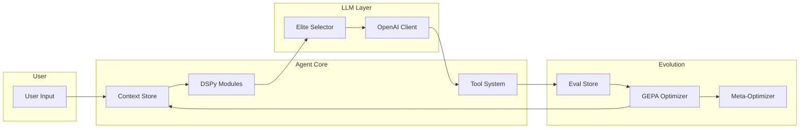
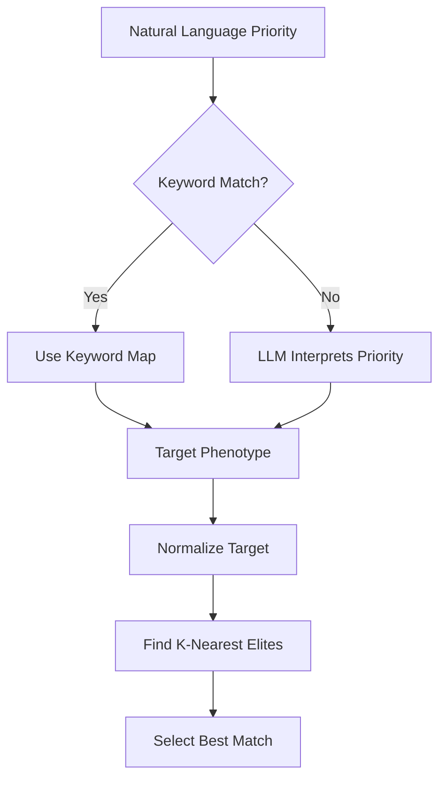
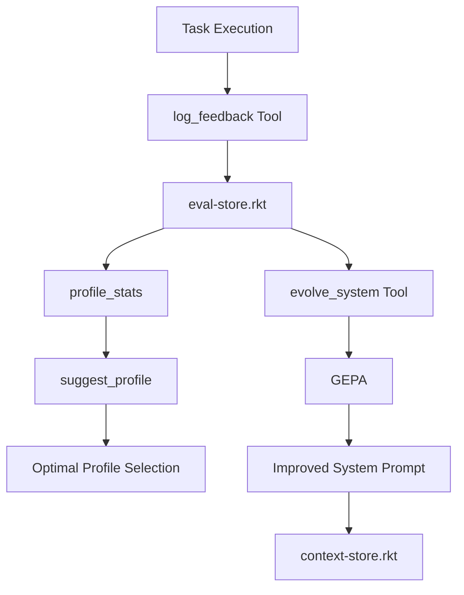
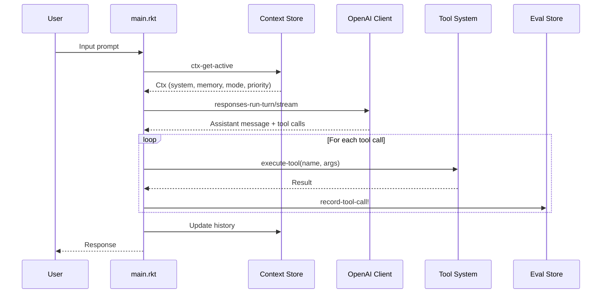
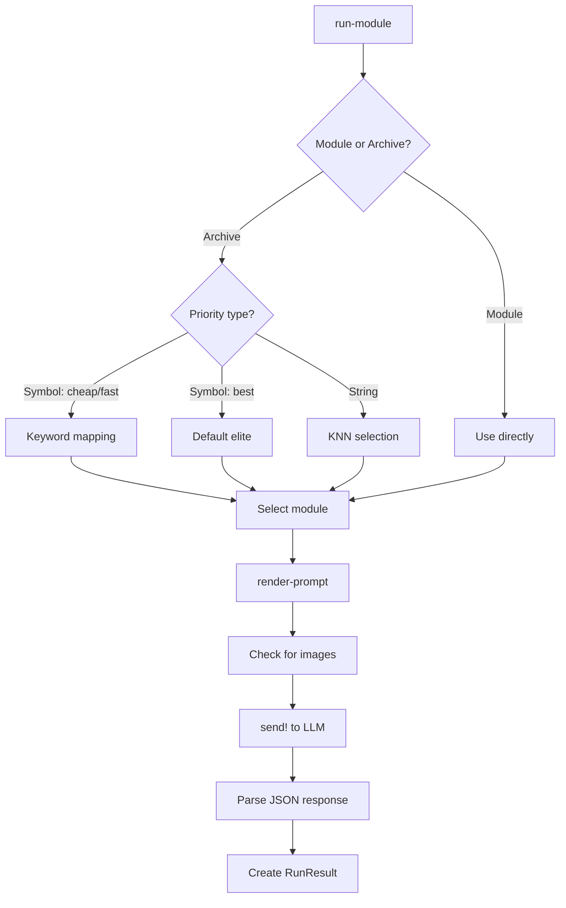
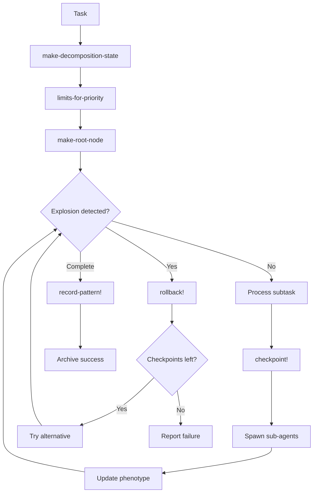
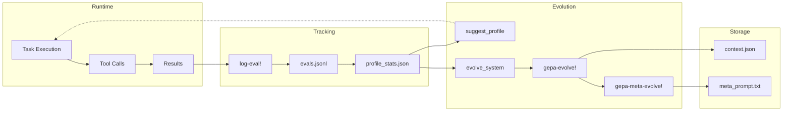

# Chrysalis Forge Architecture

> A comprehensive guide to the evolvable, safety-gated, self-improving agent framework.

## 1. System Overview

Chrysalis Forge is a Racket-based agent framework that implements the **Evolvable Module** paradigm—agents that combine logic, state, optimization, and self-improvement through continuous evolution.

### High-Level Flow



### Core Philosophy

1. **Evolvable**: System prompts and module strategies evolve based on feedback
2. **Safety-Gated**: Multi-level security with LLM judge for sensitive operations  
3. **Self-Improving**: Performance tracking drives automatic optimization
4. **Geometric Selection**: Phenotype-based elite selection for optimal module variants

---

## 2. Layer Architecture

Chrysalis Forge is organized into four distinct layers:

```
┌─────────────────────────────────────────────────────────────┐
│                        main.rkt                             │
│                    (Entry Point & REPL)                     │
├─────────────────────────────────────────────────────────────┤
│                     src/core/                               │
│  Orchestration: decomposition, optimization, sub-agents     │
├─────────────────────────────────────────────────────────────┤
│                      src/llm/                               │
│    DSPy abstractions, model selection, pricing, client      │
├─────────────────────────────────────────────────────────────┤
│                    src/stores/                              │
│     Persistence: context, traces, evals, cache, vectors     │
├─────────────────────────────────────────────────────────────┤
│                    src/tools/                               │
│          25 built-in tools (file, git, jj, web)             │
└─────────────────────────────────────────────────────────────┘
```

### Stores Layer (`src/stores/`)

Persistence and state management:

| Store | File | Purpose |
|-------|------|---------|
| **Context** | `context-store.rkt` | Agent sessions, system prompts, memory |
| **Traces** | `trace-store.rkt` | Execution logs for debugging |
| **Evals** | `eval-store.rkt` | Profile performance tracking |
| **Cache** | `cache-store.rkt` | LLM response caching |
| **Vectors** | `vector-store.rkt` | Semantic memory via embeddings |
| **RDF** | `rdf-store.rkt` | Knowledge graph (quads/hypergraph) |
| **Decomp Archive** | `decomp-archive.rkt` | Successful decomposition patterns |

All stores persist to `~/.agentd/`.

### LLM Layer (`src/llm/`)

Core abstractions for LLM interaction:

| Module | Purpose |
|--------|---------|
| `dspy-core.rkt` | Signatures, Modules, Contexts, RunResults |
| `dspy-selector.rkt` | Geometric phenotype selection (KNN) |
| `openai-client.rkt` | API client with streaming support |
| `pricing-model.rkt` | Dynamic cost calculation |

### Core Layer (`src/core/`)

Orchestration and intelligence:

| Module | Purpose |
|--------|---------|
| `geometric-decomposition.rkt` | Task breakdown with explosion detection |
| `optimizer-gepa.rkt` | Prompt evolution via feedback |
| `sub-agent.rkt` | Parallel task execution |
| `process-supervisor.rkt` | Long-running service management |
| `acp-stdio.rkt` | JSON-RPC protocol for ACP |

### Tools Layer (`src/tools/`)

25 built-in tools organized by category:

| Category | Tools |
|----------|-------|
| **File** | `read_file`, `write_file`, `patch_file`, `preview_diff`, `list_dir`, `grep_code` |
| **Git** | `git_status`, `git_diff`, `git_log`, `git_commit`, `git_checkout` |
| **Jujutsu** | `jj_status`, `jj_log`, `jj_diff`, `jj_undo`, `jj_op_log`, `jj_op_restore`, `jj_workspace_add`, `jj_workspace_list`, `jj_describe`, `jj_new` |
| **Evolution** | `suggest_profile`, `profile_stats`, `evolve_system`, `log_feedback` |
| **Web** | `web_search`, `web_fetch`, `web_search_news` |
| **MCP** | `add_mcp_server` (dynamic tool integration) |

---

## 3. DSPy Programming Model

Chrysalis Forge adapts [DSPy](https://dspy-docs.vercel.app/) concepts to Racket, providing a declarative way to define LLM-powered modules.

### Signature

A `Signature` defines the typed interface of an agent's task:

```racket
;; From src/llm/dspy-core.rkt
(struct SigField (name pred) #:transparent)
(struct Signature (name ins outs) #:transparent)

;; Example: Optimizer signature
(define OptSig 
  (signature Opt 
    (in [inst string?] [fails string?]) 
    (out [thought string?] [new_inst string?])))
```

**Fields**:
- `name`: Unique identifier
- `ins`: List of input `SigField`s with predicates
- `outs`: List of output `SigField`s

### Module

A `Module` wraps a signature with execution strategy:

```racket
(struct Module (id sig strategy instructions demos params) #:transparent)

;; Constructors
(define (Predict sig #:id [id #f] #:instructions [inst ""] #:demos [demos '()] #:params [p (hash)])
  (Module (or id (format "Predict/~a" (Signature-name sig))) sig 'predict inst demos p))

(define (ChainOfThought sig #:id [id #f] #:instructions [inst ""] #:demos [demos '()] #:params [p (hash)])
  (Module (or id (format "CoT/~a" (Signature-name sig))) sig 'cot inst demos p))
```

**Strategies**:
- **Predict**: Direct completion
- **ChainOfThought (CoT)**: Structured reasoning before output

### ModuleArchive

A collection of module variants indexed by phenotype for elite selection:

```racket
(struct ModuleArchive (id sig archive point-cloud default-id) #:transparent)
```

- `archive`: Hash of `(bin-key -> (cons score module))` for MAP-Elites evolution
- `point-cloud`: List of `(cons phenotype module)` for KNN search
- `default-id`: Fallback bin key

### Ctx (Context)

Agent context containing all runtime state:

```racket
(struct Ctx (system memory tool-hints mode priority history compacted-summary) #:transparent)

;; Constructor macro with defaults
(ctx #:system "You are a helpful agent."
     #:memory ""
     #:tool-hints ""
     #:mode 'ask
     #:priority 'best
     #:history '()
     #:compacted "")
```

**Fields**:
- `system`: System prompt (can be evolved)
- `memory`: Working scratchpad
- `tool-hints`: Guidance for tool usage
- `mode`: Operational mode gating tool access
- `priority`: Performance profile (symbol or natural language string)
- `history`: Conversation history
- `compacted-summary`: Compressed prior context

### RunResult

Execution result from running a module:

```racket
(struct RunResult (ok? outputs raw prompt meta) #:transparent)
```

- `ok?`: Success boolean
- `outputs`: Hash of output field values
- `raw`: Raw LLM response string
- `prompt`: Rendered prompt sent to LLM
- `meta`: Metadata (tokens, cost, timing)

---

## 4. Phenotype Space and Elite Selection

Chrysalis Forge uses a **geometric phenotype space** for intelligent module selection.

### Phenotype Structure

```racket
;; From src/llm/dspy-core.rkt
(struct Phenotype (accuracy latency cost usage) #:transparent)
```

A 4D continuous space:
- **accuracy**: Correctness score (0-10)
- **latency**: Response time (normalized)
- **cost**: Token cost (normalized)
- **usage**: Output verbosity (normalized)

### Normalization

For fair distance comparison, phenotypes are normalized to `[0,1]`:

```racket
;; From src/llm/dspy-selector.rkt
(define (normalize-phenotype pheno mins maxs)
  (define (safe-norm v lo hi) (if (= lo hi) 0.5 (/ (- v lo) (- hi lo))))
  (Phenotype (safe-norm (Phenotype-accuracy pheno) (first mins) (first maxs))
             (safe-norm (Phenotype-latency pheno) (second mins) (second maxs))
             (safe-norm (Phenotype-cost pheno) (third mins) (third maxs))
             (safe-norm (Phenotype-usage pheno) (fourth mins) (fourth maxs))))
```

### KNN Selection

When given a priority, the system finds the nearest elite:



**Keyword Fast-Path**:

```racket
(define KEYWORD-MAP
  (hash "fast"     (Phenotype 5.0 0.0 0.5 0.5)   ;; Low latency
        "cheap"    (Phenotype 5.0 0.5 0.0 0.5)   ;; Low cost
        "accurate" (Phenotype 10.0 0.5 0.5 0.5)  ;; High accuracy
        "concise"  (Phenotype 5.0 0.5 0.5 0.0)   ;; Low usage
        "verbose"  (Phenotype 5.0 0.5 0.5 1.0))) ;; High usage
```

---

## 5. Geometric Decomposition System

Complex tasks are broken down using a geometric approach with explosion safeguards.

### DecompositionPhenotype

A 5D space characterizing decomposition behavior:

```racket
;; From src/core/geometric-decomposition.rkt
(struct DecompositionPhenotype (depth breadth accumulated-cost context-size success-rate) #:transparent)
```

### DecompositionLimits

Thresholds that vary by priority level:

```racket
(struct DecompositionLimits (max-depth max-breadth max-cost max-context min-success-rate) #:transparent)

(define (limits-for-priority priority budget context-limit)
  (match priority
    ['critical (DecompositionLimits 10 20 (* budget 2.0) (* context-limit 1.5) 0.6)]
    ['high     (DecompositionLimits 8 15 (* budget 1.5) context-limit 0.7)]
    ['normal   (DecompositionLimits 6 10 budget (* context-limit 0.8) 0.75)]
    ['low      (DecompositionLimits 4 6 (* budget 0.5) (* context-limit 0.5) 0.8)]
    [_         (DecompositionLimits 6 10 budget context-limit 0.75)]))
```

### Explosion Detection

The system monitors for runaway decomposition:

```racket
(define (detect-explosion phenotype limits)
  (cond
    [(> (DecompositionPhenotype-depth phenotype)
        (DecompositionLimits-max-depth limits)) 'depth]
    [(> (DecompositionPhenotype-breadth phenotype)
        (DecompositionLimits-max-breadth limits)) 'breadth]
    [(> (DecompositionPhenotype-accumulated-cost phenotype)
        (DecompositionLimits-max-cost limits)) 'cost]
    [(> (DecompositionPhenotype-context-size phenotype)
        (DecompositionLimits-max-context limits)) 'context]
    [(< (DecompositionPhenotype-success-rate phenotype)
        (DecompositionLimits-min-success-rate limits)) 'low-success]
    [else #f]))
```

### Checkpoint/Rollback

Safe exploration with recovery:

```racket
;; Create checkpoint before risky operations
(define (checkpoint! state reason)
  (define snap (snapshot-tree (DecompositionState-tree state)))
  (define cp (DecompositionCheckpoint snap
                                       (DecompositionState-phenotype state)
                                       (DecompositionState-steps-taken state)
                                       reason))
  (set-DecompositionState-checkpoints! state (cons cp (DecompositionState-checkpoints state)))
  state)

;; Rollback on explosion
(define (rollback! state)
  (define cp (car (DecompositionState-checkpoints state)))
  (restore-tree! (DecompositionState-tree state) (DecompositionCheckpoint-tree-snapshot cp))
  (set-DecompositionState-phenotype! state (DecompositionCheckpoint-phenotype cp))
  state)
```

### Pattern Learning

Successful decomposition patterns are archived for reuse:

```racket
;; From src/stores/decomp-archive.rkt
(struct DecompositionPattern (id name steps metadata) #:transparent)
(struct DecompositionArchive (task-type archive point-cloud default-id) #:transparent)

(define (record-pattern! archive pattern score)
  (define pheno (compute-phenotype pattern))
  (define bin-key (phenotype->bin-key pheno))
  ;; MAP-Elites: Keep best per bin
  ...)
```

---

## 6. Sub-Agent System

Parallel task execution with specialized tool profiles.

### Tool Profiles

```racket
;; From src/core/sub-agent.rkt
(define PROFILE-EDITOR
  '("read_file" "write_file" "patch_file" "preview_diff" "list_dir"))

(define PROFILE-RESEARCHER
  '("read_file" "list_dir" "grep_code" "web_search" "web_fetch" "web_search_news"))

(define PROFILE-VCS
  '("git_status" "git_diff" "git_log" "git_commit" "git_checkout"
    "jj_status" "jj_log" "jj_diff" "jj_undo" "jj_op_log" "jj_op_restore"
    "jj_workspace_add" "jj_workspace_list" "jj_describe" "jj_new"))

(define PROFILE-ALL #f)  ;; No filtering
```

### Spawning Sub-Agents

```racket
(define (spawn-sub-agent! prompt run-fn #:context [context ""] #:profile [profile 'all])
  (set! agent-counter (add1 agent-counter))
  (define id (format "task-~a" agent-counter))
  (define result-channel (make-async-channel))
  (define tools-filter (get-tool-profile profile))
  
  (define t 
    (thread
     (λ ()
       (with-handlers ([exn:fail? (λ (e) 
                                    (async-channel-put result-channel 
                                                       (hash 'status 'error 'error (exn-message e))))])
         (define result (run-fn prompt context tools-filter))
         (async-channel-put result-channel (hash 'status 'done 'result result))))))
  
  (hash-set! SUB-AGENTS id (hash 'thread t 'channel result-channel ...))
  id)
```

### Tools for Sub-Agent Management

- `spawn_task`: Start a parallel sub-agent with optional profile
- `await_task`: Block until completion
- `task_status`: Non-blocking status check

### Integration with Eval Store

Sub-agent results are logged for learning:

```racket
(log-eval! #:task-id task-id
           #:success? success?
           #:profile profile
           #:task-type "file-edit"
           #:tools-used '("write_file" "patch_file"))
```

---

## 7. Self-Evolution System

### GEPA Evolution

**General Evolvable Prompting Architecture** evolves system prompts based on feedback:

```racket
;; From src/core/optimizer-gepa.rkt
(define (gepa-evolve! feedback [model "gpt-5.2"])
  (define active (ctx-get-active))
  (define sender (make-openai-sender #:model model))
  (define-values (ok? res usage) 
    (sender (format "~a\nCURRENT: ~a\nFEEDBACK: ~a" (get-meta) (Ctx-system active) feedback)))
  (if ok?
      (let ([new-sys (hash-ref (string->jsexpr res) 'new_system_prompt)])
        (save-ctx! ...)  ;; Save evolved context
        "Context Evolved.")
      "Evolution Failed."))
```

### Meta-Evolution

The optimizer itself can evolve:

```racket
(define (gepa-meta-evolve! feedback [model "gpt-5.2"])
  (define sender (make-openai-sender #:model model))
  (define-values (ok? res usage) 
    (sender (format "Rewrite this optimizer prompt:\n~a\nFeedback: ~a\nReturn JSON {new_meta_prompt}" 
                    (get-meta) feedback)))
  (if ok? 
      (begin 
        (display-to-file (hash-ref (string->jsexpr res) 'new_meta_prompt) META-PATH #:exists 'replace) 
        "Meta-Optimizer Evolved.") 
      "Failed."))
```

### Eval Store

Tracks profile performance for learning:

```racket
;; From src/stores/eval-store.rkt
(define (log-eval! #:task-id task-id #:success? success? #:profile profile
                   #:task-type [task-type "unknown"] #:tools-used [tools-used '()]
                   #:duration-ms [duration-ms 0] #:feedback [feedback ""])
  ;; Append to ~/.agentd/evals.jsonl
  ;; Update aggregate stats in ~/.agentd/profile_stats.json
  ...)

(define (suggest-profile task-type)
  ;; Returns (values best-profile success-rate)
  ;; Based on historical performance
  ...)
```

### Feedback Loop



---

## 8. Mode System and Security

### Operational Modes

Modes gate tool access based on operational requirements:

| Mode | Description | Tool Access |
|------|-------------|-------------|
| `ask` | Basic interaction | No filesystem |
| `architect` | Code analysis | Read-only files |
| `code` | Full development | Full FS, network, services |
| `semantic` | Knowledge graph | RDF tools, memory |

```racket
;; From main.rkt
(define ACP-MODES
  (list (hash 'slug "ask" 'name "Ask" 'description "Read only.")
        (hash 'slug "architect" 'name "Architect" 'description "Read files.")
        (hash 'slug "code" 'name "Code" 'description "Full FS/Net.")
        (hash 'slug "semantic" 'name "Semantic" 'description "RDF Graph.")))
```

### Security Levels

Numeric levels (0-3) plus "god mode":

| Level | Capabilities |
|-------|--------------|
| 0 | No file access |
| 1 | Read files (except restricted) |
| 2 | Write files, git commits, MCP |
| 3 | Terminal commands |
| 4 (god) | All operations, no confirmations |

```racket
(define (execute-tool name args)
  (match name
    ["write_file" 
     (if (>= (current-security-level) 2)
         (begin 
           (when (< (current-security-level) 4) 
             (confirm-risk! "WRITE" (hash-ref args 'path)))
           ...)
         "Permission Denied: Requires Level 2.")]
    ["run_term" 
     (if (>= (current-security-level) 3) ... "Permission Denied: Requires Level 3.")]
    ...))
```

### LLM Judge

Optional security auditor for sensitive operations:

```racket
(define (evaluate-safety action content)
  (unless (llm-judge-param) (values #t ""))
  
  (define sender (make-openai-sender #:model (llm-judge-model-param)))
  (define prompt 
    (format "You are a Security Auditor. A user or agent is attempting:
ACTION: ~a
CONTENT: ~a

Is this safe? Reply [SAFE] or [UNSAFE] with explanation." action content))
  (define-values (ok? res usage) (sender prompt))
  (if (and ok? (string-contains? res "[SAFE]"))
      (values #t res)
      (values #f res)))
```

---

## 9. Data Flow Diagrams

### Request Processing Flow



### Module Execution Flow



### Decomposition Flow with Checkpoints



### Evolution Feedback Loop



---

## 10. Extension Points

### Adding Custom Tools

1. Define tool schema in `make-acp-tools`:

```racket
(hash 'type "function"
      'function (hash 'name "my_custom_tool"
                      'description "Does something useful"
                      'parameters (hash 'type "object"
                                        'properties (hash 'arg1 (hash 'type "string"))
                                        'required '("arg1"))))
```

2. Add handler in `execute-acp-tool`:

```racket
["my_custom_tool"
 (if (>= security-level 1)
     (my-tool-impl (hash-ref args 'arg1))
     "Permission Denied")]
```

### Creating New Modules

```racket
(require "src/llm/dspy-core.rkt")

;; Define signature
(define MySig 
  (signature MyTask 
    (in [input string?] [context string?]) 
    (out [result string?] [confidence number?])))

;; Create module with instructions
(define my-module 
  (ChainOfThought MySig 
    #:instructions "Analyze the input and provide a confident result."
    #:demos '((#hash((input . "example") (context . "test") (result . "answer") (confidence . 0.95))))))

;; Run
(define result (run-module my-module ctx inputs send!))
```

### Defining Custom Entity Types for RDF

```racket
(require "src/stores/rdf-store.rkt")

;; Insert triples with custom predicates
(rdf-insert! "entity:User123" "type" "schema:Person" "users")
(rdf-insert! "entity:User123" "name" "Alice" "users")
(rdf-insert! "entity:User123" "worksFor" "entity:Acme" "users")

;; Query with patterns
(rdf-query "entity:User123 ?p ?o" "users")  ;; All properties of User123
(rdf-query "?s worksFor entity:Acme" "users")  ;; Who works for Acme
```

### Custom Optimization Strategies

Extend GEPA with domain-specific optimization:

```racket
(define (domain-specific-evolve! feedback domain-rules)
  (define active (ctx-get-active))
  (define augmented-meta 
    (string-append (get-meta) 
                   "\n\nDomain Rules:\n" 
                   domain-rules))
  (define sender (make-openai-sender #:model "gpt-5.2"))
  (define-values (ok? res usage) 
    (sender (format "~a\nCURRENT: ~a\nFEEDBACK: ~a" 
                    augmented-meta (Ctx-system active) feedback)))
  ...)
```

---

## Appendix: File Reference

| File | Purpose |
|------|---------|
| `main.rkt` | Entry point, REPL, command-line parsing |
| `src/llm/dspy-core.rkt` | Core DSPy structs and `run-module` |
| `src/llm/dspy-selector.rkt` | Phenotype distance, KNN selection |
| `src/llm/openai-client.rkt` | HTTP client for OpenAI API |
| `src/llm/pricing-model.rkt` | Token cost calculation |
| `src/core/geometric-decomposition.rkt` | Task decomposition with limits |
| `src/core/optimizer-gepa.rkt` | System prompt evolution |
| `src/core/sub-agent.rkt` | Parallel sub-agent spawning |
| `src/core/process-supervisor.rkt` | Long-running service management |
| `src/stores/context-store.rkt` | Session and context persistence |
| `src/stores/eval-store.rkt` | Performance tracking |
| `src/stores/vector-store.rkt` | Semantic memory (embeddings) |
| `src/stores/rdf-store.rkt` | Knowledge graph (SQLite) |
| `src/stores/decomp-archive.rkt` | Decomposition pattern archive |
| `src/tools/acp-tools.rkt` | Built-in tool definitions |

---

*Last updated: January 2026*
