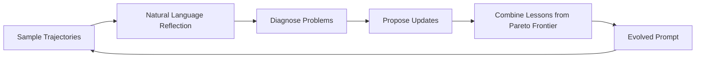
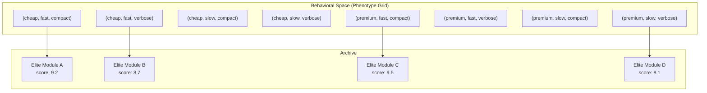
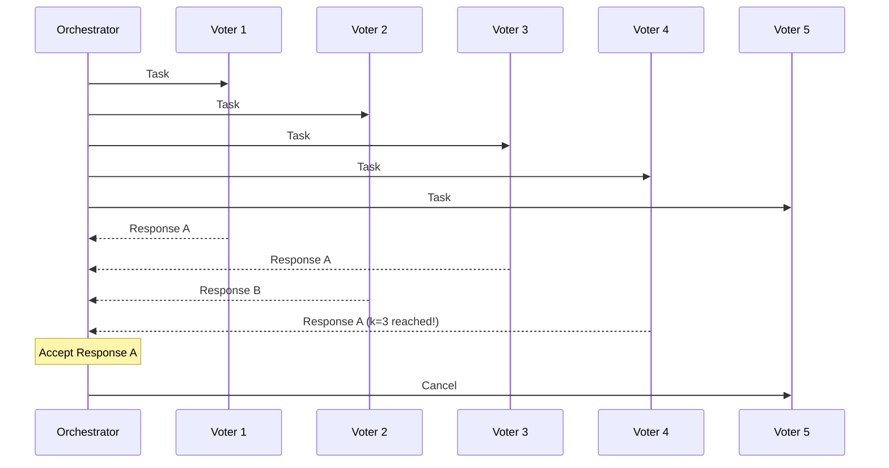
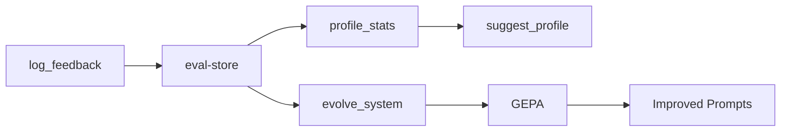
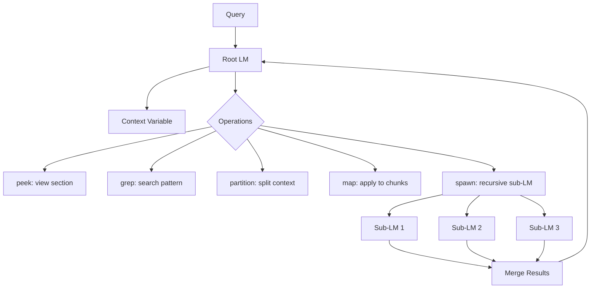
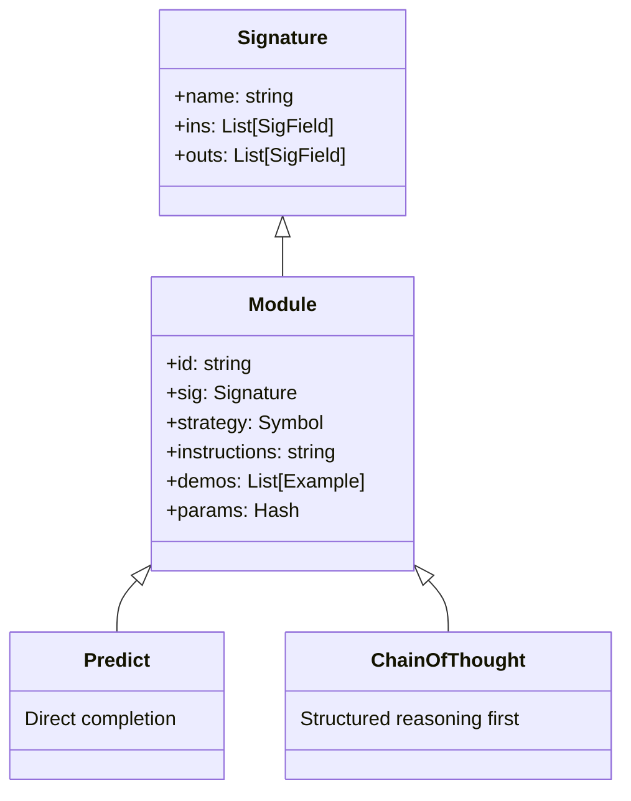
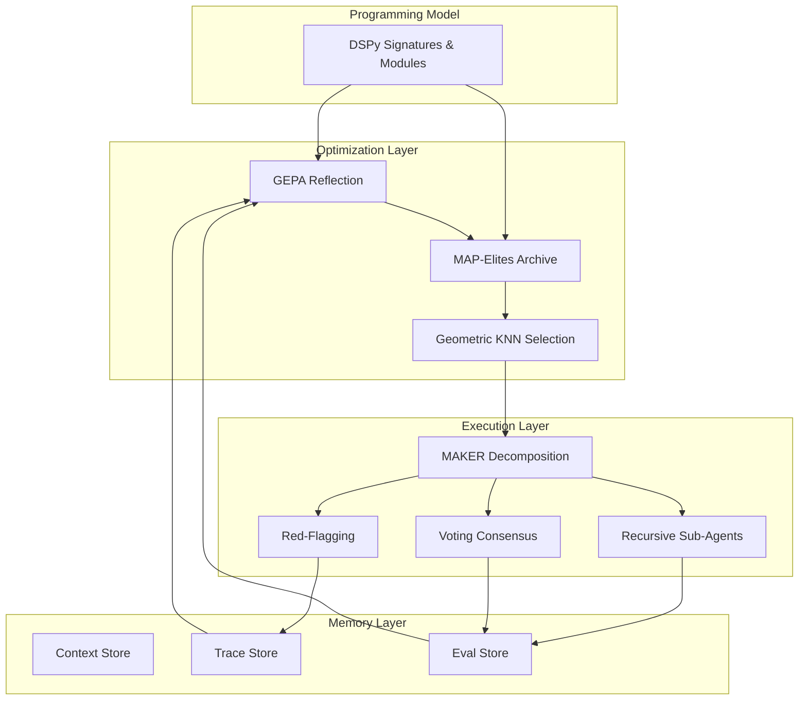

# Theoretical Foundations of Chrysalis Forge

> **Chrysalis Forge synthesizes ideas from evolutionary computation, geometric representation learning, reliable multi-agent systems, and temporal knowledge management into a unified framework for building self-improving AI agents.**

This document explains the research papers and concepts that inspired Chrysalis Forge, written for researchers, students, and developers who want to understand the theoretical underpinnings of the system.

---

## Table of Contents

1. [GEPA: Reflective Prompt Evolution](#1-gepa-reflective-prompt-evolution)
2. [MAP-Elites and Quality-Diversity Optimization](#2-map-elites-and-quality-diversity-optimization)
3. [Grassmann Flows and Geometric Attention](#3-grassmann-flows-and-geometric-attention)
4. [MAKER: Extreme Decomposition for Reliability](#4-maker-extreme-decomposition-for-reliability)
5. [Graphiti/Zep: Temporal Knowledge Graphs](#5-graphitizep-temporal-knowledge-graphs)
6. [Recursive Language Models](#6-recursive-language-models)
7. [DSPy Programming Model](#7-dspy-programming-model)
8. [Synthesis: How These Ideas Combine](#synthesis-how-these-ideas-combine)

---

## 1. GEPA: Reflective Prompt Evolution

### Paper Reference

**"GEPA: Reflective Prompt Evolution Can Outperform Reinforcement Learning"**  
arXiv:2507.19457 (July 2025)

### Key Insight

Natural language reflection provides richer learning signals than sparse RL rewards. Instead of treating prompt optimization as a bandit problem with binary success/failure signals, GEPA leverages the LLM's ability to *understand* why something failed and articulate improvements.

### How It Works



1. **Trajectory Sampling**: Run the current prompt on a diverse set of tasks
2. **Reflection Phase**: The LLM analyzes its own failures in natural language
3. **Diagnosis**: Extract patterns from failures (e.g., "I consistently miss edge cases with negative numbers")
4. **Proposal**: Generate candidate prompt improvements that address diagnosed issues
5. **Pareto Selection**: Keep improvements that advance on any objective without regressing on others

### Results

GEPA outperforms GRPO (Group Relative Policy Optimization) by 10-20% while using **35× fewer rollouts**. This efficiency comes from the richness of natural language feedback compared to scalar rewards.

### Chrysalis Implementation

The [`optimizer-gepa.rkt`](../src/core/optimizer-gepa.rkt) module implements reflective prompt evolution:

```racket
(define (gepa-evolve! feedback [model "gpt-5.2"])
  ;; Load current system prompt
  (define active (ctx-get-active))
  ;; Ask LLM to rewrite based on feedback
  (define-values (ok? res usage) 
    (sender (format "~a\nCURRENT: ~a\nFEEDBACK: ~a" 
                    (get-meta) (Ctx-system active) feedback)))
  ;; Save evolved context
  (save-ctx! ...))
```

The `gepa-evolve!` function:
- Takes natural language **feedback** describing what went wrong
- Passes current system prompt and feedback to an optimizer LLM
- Returns a new system prompt that incorporates the lessons

The **meta-optimizer** (`gepa-meta-evolve!`) takes this further by evolving the optimizer's own instructions, creating a recursive self-improvement loop.

---

## 2. MAP-Elites and Quality-Diversity Optimization

### Paper Reference

**"Illuminating search spaces by mapping elites"**  
Jean-Baptiste Mouret & Jeff Clune  
arXiv:1504.04909 (April 2015)

### Key Insight

Maintain a *map* of high-performing solutions across behavioral dimensions, not just one globally optimal solution. This provides:
- **Diversity**: Solutions for different priorities/contexts
- **Robustness**: Backup solutions if the "best" fails
- **Exploration**: Local competition in bins prevents premature convergence

### How It Works



The behavioral space is discretized into **bins** based on observable characteristics (phenotype). Each bin maintains only the highest-scoring solution. New solutions compete **locally within their bin**, not globally.

### Phenotype Dimensions in Chrysalis

| Dimension | Description | Measurement |
|-----------|-------------|-------------|
| `accuracy` | Correctness of output | 0-10 score vs. expected |
| `latency` | Response time | Elapsed milliseconds |
| `cost` | Token expenditure | Calculated from model pricing |
| `usage` | Output verbosity | Total tokens generated |

### Chrysalis Implementation

The [`dspy-core.rkt`](../src/llm/dspy-core.rkt) module defines the archive structure:

```racket
(struct Phenotype (accuracy latency cost usage) #:transparent)

(struct ModuleArchive 
  (id sig archive point-cloud default-id) 
  #:transparent)
;; archive: hash of (bin-key → (cons score module)) for evolution
;; point-cloud: list of (cons phenotype module) for KNN search
```

The [`dspy-compile.rkt`](../src/llm/dspy-compile.rkt) optimizer maintains this archive:

```racket
(define (compile! m ctx trainset send! ...)
  ;; 1. Bootstrap initial population
  ;; 2. Establish relative thresholds from medians
  ;; 3. Evolutionary loop: mutate elites, evaluate, archive
  ;; 4. Return ModuleArchive with discrete bins + continuous point cloud
  ...)
```

Key insight: Chrysalis maintains **both** discrete bins (for backwards-compatible keyword selection) and a continuous **point cloud** (for geometric KNN selection).

---

## 3. Grassmann Flows and Geometric Attention

### Paper Reference

**"Attention Is Not What You Need"**  
Zhang Chong  
arXiv:2512.19428 (December 2025)

### Key Insight

Standard attention is fundamentally a **tensor lifting** operation. It can be replaced with structured manifold operations on Grassmann manifolds, yielding:
- Linear scaling in sequence length (vs. quadratic for attention)
- More interpretable geometric invariants
- Natural handling of subspace relationships

### How It Works

1. **Plücker Coordinates**: Encode token pairs as 2D subspaces
2. **Gated Mixing**: Fuse representations via geometric operations
3. **Controlled Deformations**: Propagate information over local windows

The key mathematical object is the **Grassmannian** Gr(k, n)—the space of all k-dimensional subspaces of an n-dimensional vector space.

### Chrysalis Implementation

While Chrysalis doesn't implement Grassmann flows directly (that would require a custom neural architecture), it adopts the **geometric philosophy** for task and module selection.

The [`dspy-selector.rkt`](../src/llm/dspy-selector.rkt) module uses phenotype spaces as continuous geometric coordinates:

```racket
(define (phenotype-distance p1 p2)
  (sqrt (+ (expt (- (Phenotype-accuracy p1) (Phenotype-accuracy p2)) 2)
           (expt (- (Phenotype-latency p1) (Phenotype-latency p2)) 2)
           (expt (- (Phenotype-cost p1) (Phenotype-cost p2)) 2)
           (expt (- (Phenotype-usage p1) (Phenotype-usage p2)) 2))))

(define (select-elite archive target)
  ;; Normalize point cloud to [0,1]
  ;; Find nearest neighbor to target phenotype
  ;; Return corresponding module
  ...)
```

This geometric approach allows **natural language priority mapping**:

```racket
(define KEYWORD-MAP
  (hash "fast"     (Phenotype 5.0 0.0 0.5 0.5)   ; Prioritize low latency
        "cheap"    (Phenotype 5.0 0.5 0.0 0.5)   ; Prioritize low cost  
        "accurate" (Phenotype 10.0 0.5 0.5 0.5)  ; Prioritize accuracy
        ...))
```

The user says "I need something fast and cheap" → mapped to target phenotype → KNN finds closest elite in archive.

---

## 4. MAKER: Extreme Decomposition for Reliability

### Paper Reference

**"Solving a Million-Step LLM Task with Zero Errors"**  
arXiv:2511.09030 (November 2025)

### Key Insight

Reliability scales through **extreme decomposition** and **local error correction**, not bigger models. Three mechanisms work together:

1. **MAD (Maximal Agentic Decomposition)**: Decompose to atomic subtasks, one decision per microagent
2. **First-to-K Voting**: Run parallel agents, accept first action with k more votes than alternatives
3. **Red-flagging**: Automatically discard unreliable responses

### Results

MAKER achieved million-step tasks with **zero errors**—a remarkable result that demonstrates the power of compositional reliability.

### First-to-K Voting



The system accepts the **first response that reaches k votes**, not waiting for all voters to complete.

### Chrysalis Implementation

#### Voting Consensus ([`decomp-voter.rkt`](../src/core/decomp-voter.rkt))

```racket
(struct VotingConfig (n-voters k-threshold timeout-ms decorrelate?) #:transparent)

(define VOTING-NONE     (VotingConfig 1 1 30000 #f))
(define VOTING-LOW      (VotingConfig 2 2 45000 #t))
(define VOTING-MEDIUM   (VotingConfig 3 2 60000 #t))
(define VOTING-HIGH     (VotingConfig 5 3 90000 #t))
(define VOTING-CRITICAL (VotingConfig 7 4 120000 #t))
```

| Scenario | Voters | K-Threshold | Use Case |
|----------|--------|-------------|----------|
| None | 1 | 1 | Default (no voting) |
| Low | 2 | 2 | Low-stakes operations |
| Medium | 3 | 2 | Standard operations |
| High | 5 | 3 | Important changes |
| Critical | 7 | 4 | Destructive operations |

The `decorrelate?` flag varies temperature and random seeds across voters to reduce correlated errors.

#### Explosion Detection ([`geometric-decomposition.rkt`](../src/core/geometric-decomposition.rkt))

```racket
(define (detect-explosion phenotype limits)
  (cond
    [(> (DecompositionPhenotype-depth phenotype)
        (DecompositionLimits-max-depth limits))
     'depth]
    [(> (DecompositionPhenotype-breadth phenotype)
        (DecompositionLimits-max-breadth limits))
     'breadth]
    [(> (DecompositionPhenotype-accumulated-cost phenotype)
        (DecompositionLimits-max-cost limits))
     'cost]
    [(> (DecompositionPhenotype-context-size phenotype)
        (DecompositionLimits-max-context limits))
     'context]
    [(< (DecompositionPhenotype-success-rate phenotype)
        (DecompositionLimits-min-success-rate limits))
     'low-success]
    [else #f]))
```

When explosion is detected, the system **rolls back** to the last checkpoint and **prunes** the offending branch.

#### Red-Flagging ([`red-flag.rkt`](../src/utils/red-flag.rkt))

Responses are automatically discarded if they show unreliability:

```racket
(define (red-flag-response response [config DEFAULT-RED-FLAG-CONFIG])
  (filter values
          (list (check-length-explosion response config)
                (check-format-violation response config)
                (check-low-confidence response config)
                (check-repetition response config)
                (check-incoherence response))))
```

| Check | Detection | Severity |
|-------|-----------|----------|
| Length explosion | Response > max length | Critical |
| Format violation | Doesn't match expected pattern | Critical |
| Low confidence | Phrases like "I'm not sure" | Warning |
| Repetition | N-gram repetition ratio > threshold | Warning |
| Incoherence | Empty, garbled, or contradictory | Critical |

---

## 5. Graphiti/Zep: Temporal Knowledge Graphs

### Paper Reference

**"Zep: A Temporal Knowledge Graph Architecture for Agent Memory"**  
arXiv:2501.13956 (January 2025)

### Key Insight

Agent memory requires **bi-temporal** tracking:
- **Event time**: When did this fact become true in the world?
- **Ingestion time**: When did the system learn this fact?

This separation enables:
- Reasoning about when facts were valid
- Handling contradictions via temporal edge invalidation
- Incremental updates without reprocessing history

### Features

- **Real-time incremental updates**: No batch reindexing
- **Hybrid retrieval**: Semantic + keyword + graph traversal
- **Temporal invalidation**: New facts can supersede old ones

### Results

- 94.8% on DMR (Dynamic Memory Retrieval) benchmark
- 90% latency reduction on LongMemEval

### Chrysalis Implementation

While Chrysalis doesn't implement a full temporal knowledge graph, it implements the **core pattern** across multiple stores:

#### Context Store ([`context-store.rkt`](../src/stores/context-store.rkt))

Manages agent context with temporal sessions:

```racket
(struct Ctx (system memory tool-hints mode priority history compacted-summary) 
  #:transparent)
```

The `history` field maintains conversation turns, and `compacted-summary` provides temporal compression of older context.

#### Trace Store ([`trace-store.rkt`](../src/stores/trace-store.rkt))

Logs all operations for learning and debugging:

```racket
(define (log-trace! #:task task #:history history #:tool-results tool-results 
                    #:final-response final #:tokens [tokens (hash)] #:cost [cost 0.0])
  ;; Append JSONL with timestamp
  (call-with-output-file TRACE-PATH
    (λ (out) (write-json (hash 'ts (current-seconds) ...) out) (newline out))
    #:exists 'append))
```

#### Eval Store ([`eval-store.rkt`](../src/stores/eval-store.rkt))

Tracks task results by profile for organic learning:

```racket
(define (log-eval! #:task-id task-id #:success? success? #:profile profile ...)
  ;; Log to evals.jsonl
  ;; Update running statistics
  (update-profile-stats! profile success? task-type tools-used))

(define (suggest-profile task-type)
  ;; Query historical success rates
  ;; Return best-performing profile for this task type
  ...)
```

This creates a **feedback loop**:



---

## 6. Recursive Language Models

### Paper Reference

**"Recursive Language Models"**  
Zhang, Kraska, Khattab  
arXiv:2512.24601 (December 2025)

### Key Insight

Handle unbounded context by letting the model **recursively decompose and interact with context via REPL**. The model becomes an active participant in context management, not a passive consumer of fixed-length inputs.

### How It Works



### Results

RLM(GPT-5-mini) outperforms GPT-5 by **114%** on long-context benchmarks, and can handle **10M+ tokens** effectively.

### Chrysalis Implementation

The [`sub-agent.rkt`](../src/core/sub-agent.rkt) module implements parallel sub-agent spawning:

```racket
(define (spawn-sub-agent! prompt run-fn #:context [context ""] #:profile [profile 'all])
  ;; Generate unique ID
  ;; Create async channel for results
  ;; Spawn thread with filtered tool access
  ;; Return task ID for later awaiting
  ...)
```

#### Tool Profiles

Sub-agents operate with **focused tool access**:

| Profile | Tools | Use Case |
|---------|-------|----------|
| `editor` | read_file, write_file, patch_file, preview_diff, list_dir | File modification |
| `researcher` | read_file, list_dir, grep_code, web_search, web_fetch | Information gathering |
| `vcs` | git_*, jj_* | Version control |
| `all` | Full toolkit | General tasks |

```racket
(define PROFILE-EDITOR
  '("read_file" "write_file" "patch_file" "preview_diff" "list_dir"))

(define PROFILE-RESEARCHER
  '("read_file" "list_dir" "grep_code" "web_search" "web_fetch" "web_search_news"))

(define PROFILE-VCS
  '("git_status" "git_diff" "git_log" "git_commit" "git_checkout"
    "jj_status" "jj_log" "jj_diff" "jj_undo" ...))
```

This mirrors RLM's ability to spawn specialized sub-models for different aspects of a task.

---

## 7. DSPy Programming Model

### Reference

**Stanford DSPy Framework**  
[DSPy GitHub Repository](https://github.com/stanfordnlp/dspy)

### Key Insight

Treat LLM prompts as **typed modules** with signatures (inputs/outputs). This enables:
- Composable prompt programs
- Automatic optimization of instructions and demonstrations
- Type-safe data flow between LLM calls

### Components



### Chrysalis Implementation

The [`dspy-core.rkt`](../src/llm/dspy-core.rkt) module provides the programming model:

```racket
;; Define a signature
(define OptSig 
  (signature Opt 
    (in [inst string?] [fails string?]) 
    (out [thought string?] [new_inst string?])))

;; Create a module
(define (make-meta-optimizer) 
  (ChainOfThought OptSig 
    #:instructions "Fix failing examples. Return JSON." 
    #:params (hash 'temperature 0.7)))

;; Run the module
(define result (run-module module ctx inputs send!))
```

#### Scoring

The `score-result` function computes composite scores:

```racket
(define (score-result expected rr)
  ;; 1. Accuracy Score (0 to 10)
  (define accuracy (if (equal? expected actual) 10.0 0.0))
  
  ;; 2. Latency Penalty
  (define latency-penalty (min 2.0 (/ elapsed 5000.0)))
  
  ;; 3. Cost Penalty
  (define cost-penalty (* cost 1000.0))
  
  ;; Composite
  (max 0.1 (- accuracy latency-penalty cost-penalty)))
```

#### Compilation

The [`dspy-compile.rkt`](../src/llm/dspy-compile.rkt) module optimizes modules:

```racket
(define (compile! m ctx trainset send! ...)
  ;; 1. Bootstrap few-shot examples
  (define demos (bootstrap-fewshot trainset #:k k))
  
  ;; 2. Generate instruction mutations
  (define seeds (default-instruction-mutations (Module-instructions m0)))
  
  ;; 3. Evolutionary loop with MAP-Elites
  (for ([i (range iters)])
    (define parent-mod (cdr (hash-ref archive parent-key)))
    (define-values (child-mod thought) 
      (meta-optimize-module parent-mod ctx trainset send!))
    (update-archive! child-mod score p-key res-list))
  
  ;; 4. Return ModuleArchive
  (ModuleArchive id sig archive point-cloud best-key))
```

---

## Synthesis: How These Ideas Combine

Chrysalis Forge synthesizes these research concepts into a unified system:



### Integration Points

| Component | Provides | Consumes |
|-----------|----------|----------|
| **DSPy** | Typed module interface | - |
| **GEPA** | Evolved prompts | Feedback from eval store |
| **MAP-Elites** | Diverse elite modules | Module evaluations |
| **Geometric Selection** | Priority-based module choice | User priorities, phenotype archive |
| **MAKER Decomposition** | Atomic subtasks | Complex task input |
| **Voting** | Reliable consensus | Parallel agent responses |
| **Red-Flagging** | Filtered responses | Raw LLM outputs |
| **Sub-Agents** | Parallel execution | Decomposed subtasks |
| **Temporal Stores** | Learning signal | All operations |

### The Complete Flow

1. **User Request** enters the system with an optional priority ("fast", "accurate", etc.)

2. **Module Selection**: Geometric KNN finds the best module variant from the MAP-Elites archive based on the priority's phenotype

3. **Task Decomposition**: MAKER principles decompose complex tasks into atomic subtasks, with explosion detection preventing runaway decomposition

4. **Parallel Execution**: Sub-agents execute subtasks with specialized tool profiles (editor, researcher, vcs)

5. **Voting & Filtering**: For high-stakes operations, First-to-K voting ensures consensus; red-flagging discards unreliable responses

6. **Result Aggregation**: Subtask results merge back up the decomposition tree

7. **Logging**: All operations log to trace and eval stores

8. **Learning**: GEPA uses feedback and historical performance to evolve prompts; MAP-Elites updates the archive with new elites

9. **Continuous Improvement**: The system gets better at both *what* to do (prompt content) and *how* to do it (decomposition strategies) over time

### Design Principles

1. **Composability**: Every component is independently useful but designed for integration

2. **Self-Regulation**: Explosion detection, red-flagging, and voting provide automatic quality control

3. **Organic Learning**: The system improves from usage without explicit retraining

4. **Priority-Awareness**: From module selection to decomposition limits, user priorities propagate throughout

5. **Graceful Degradation**: Checkpoints, rollbacks, and fallbacks ensure robustness

---

## Further Reading

### Primary Papers

| Paper | Year | Key Contribution |
|-------|------|------------------|
| [GEPA](https://arxiv.org/abs/2507.19457) | 2025 | Reflective prompt evolution |
| [MAP-Elites](https://arxiv.org/abs/1504.04909) | 2015 | Quality-diversity optimization |
| [Grassmann Flows](https://arxiv.org/abs/2512.19428) | 2025 | Geometric attention replacement |
| [MAKER](https://arxiv.org/abs/2511.09030) | 2025 | Million-step reliability |
| [Zep](https://arxiv.org/abs/2501.13956) | 2025 | Temporal knowledge graphs |
| [RLM](https://arxiv.org/abs/2512.24601) | 2025 | Recursive context management |

### Related Work

- **DSPy**: [Stanford NLP DSPy](https://github.com/stanfordnlp/dspy)
- **GRPO**: Group Relative Policy Optimization for LLM alignment
- **Pareto Optimization**: Multi-objective evolutionary optimization
- **Quality-Diversity**: [QD algorithms overview](https://quality-diversity.github.io/)

### Chrysalis Source Files

| Module | Path | Purpose |
|--------|------|---------|
| Core DSPy | [src/llm/dspy-core.rkt](../src/llm/dspy-core.rkt) | Signatures, modules, archives |
| Compilation | [src/llm/dspy-compile.rkt](../src/llm/dspy-compile.rkt) | MAP-Elites evolution |
| Geometric Selection | [src/llm/dspy-selector.rkt](../src/llm/dspy-selector.rkt) | KNN phenotype selection |
| GEPA Optimizer | [src/core/optimizer-gepa.rkt](../src/core/optimizer-gepa.rkt) | Reflective evolution |
| Meta Optimizer | [src/core/optimizer-meta.rkt](../src/core/optimizer-meta.rkt) | Self-improving optimizer |
| Decomposition | [src/core/geometric-decomposition.rkt](../src/core/geometric-decomposition.rkt) | MAKER-style decomposition |
| Voting | [src/core/decomp-voter.rkt](../src/core/decomp-voter.rkt) | First-to-K consensus |
| Red Flags | [src/utils/red-flag.rkt](../src/utils/red-flag.rkt) | Response filtering |
| Sub-Agents | [src/core/sub-agent.rkt](../src/core/sub-agent.rkt) | Parallel execution |
| Context Store | [src/stores/context-store.rkt](../src/stores/context-store.rkt) | Session management |
| Eval Store | [src/stores/eval-store.rkt](../src/stores/eval-store.rkt) | Performance tracking |
| Trace Store | [src/stores/trace-store.rkt](../src/stores/trace-store.rkt) | Operation logging |

---

*This document is part of the Chrysalis Forge project. For implementation details, see the source code linked above. For usage examples, see the main [README](../README.md).*
